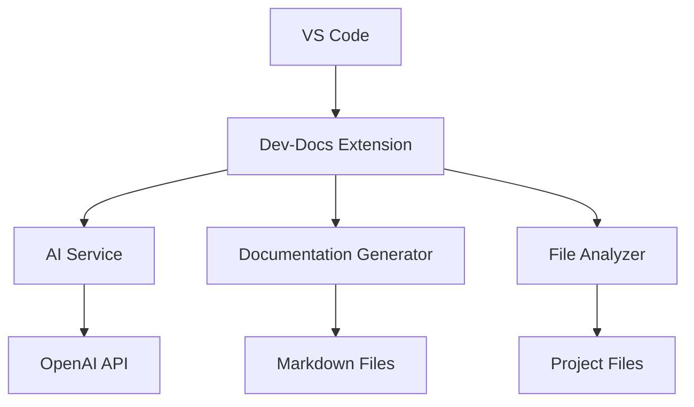
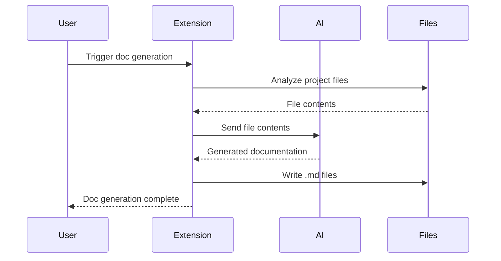
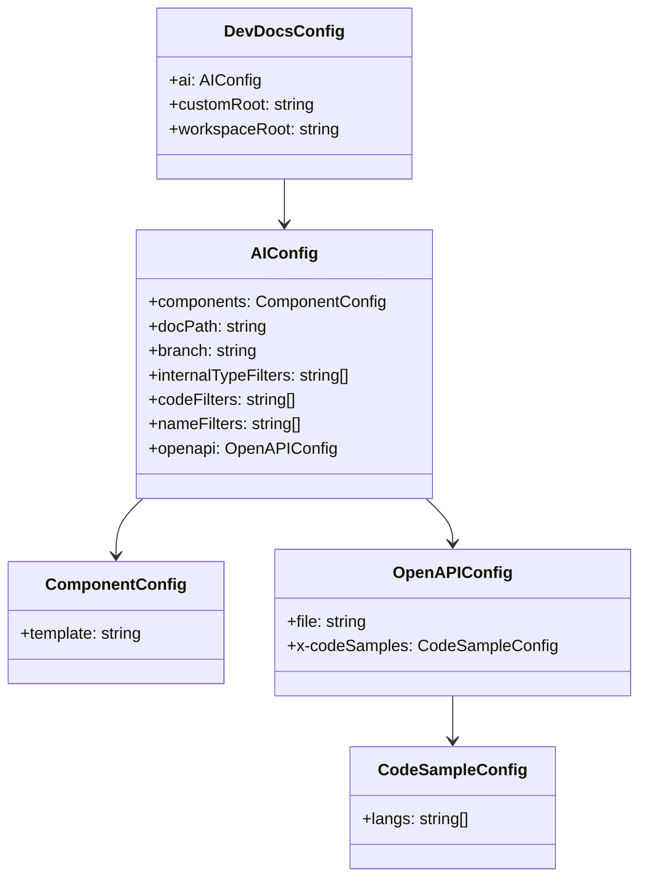

# Visual Aids for Explaining Complex Concepts in Dev-Docs VS Code Extension

To help explain some of the complex concepts in the Dev-Docs VS Code extension, here are some visual aids:

## Extension Architecture Overview

## Documentation Generation Process

## Configuration Options Visualization

These diagrams provide visual representations of the extension's architecture, documentation generation process, and configuration options structure to help explain these complex concepts more clearly.