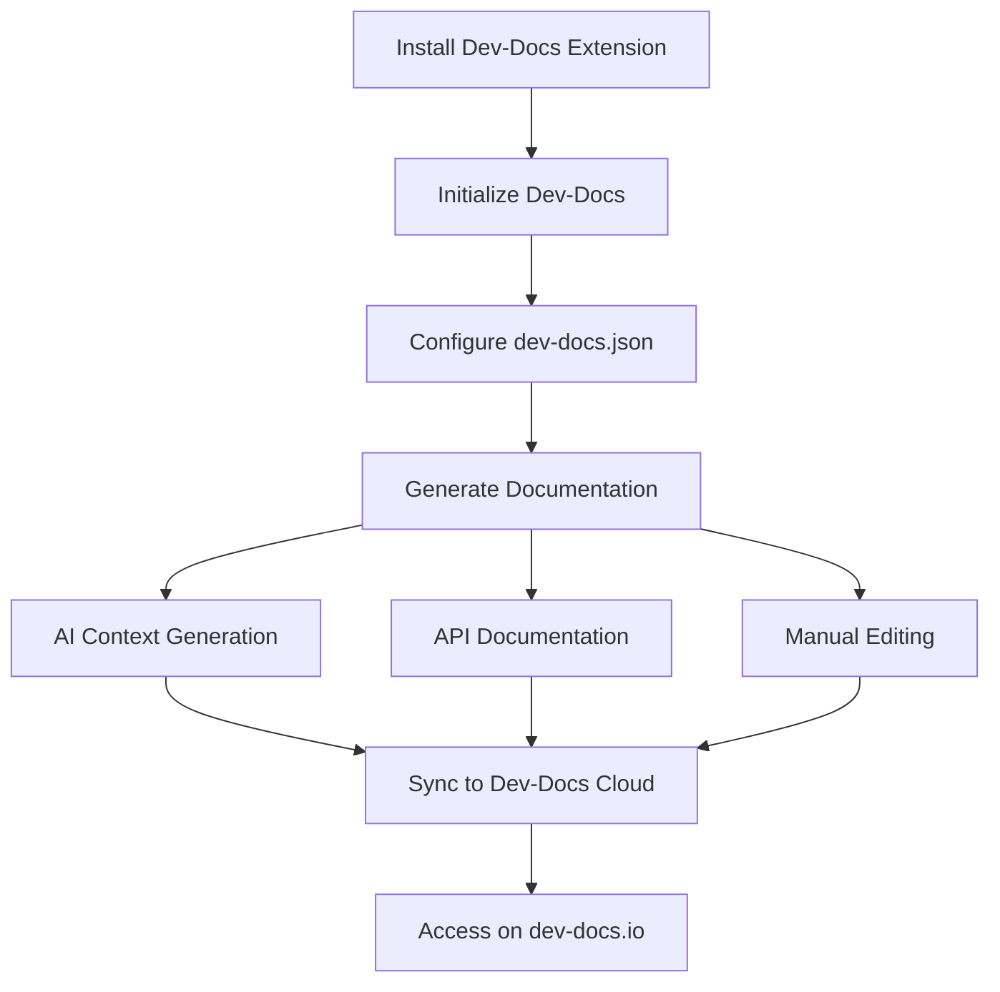

# Dev-Docs: AI-Powered Documentation Generator

## Overview

Dev-Docs is an AI-powered documentation generator designed to streamline the process of creating and maintaining internal documentation for software projects. It integrates seamlessly with Visual Studio Code and offers features like AI-generated context,


API documentation, and cloud synchronization.

## Key Features

1. AI-powered documentation generation

2. VS Code integration

3. Context generation for multiple files

4. API documentation generation

5. Cloud synchronization

6. Customizable AI prompts

## How It Works



## Getting Started

1. Install the Dev-Docs extension in VS Code

2. Initialize Dev-Docs in your project

3. Configure the `dev-docs.json` file

4. Generate documentation using AI or manually

5. Sync your documentation to Dev-Docs Cloud

## Documentation Structure

* Customize Your AI Generation

* Generate Context on Multiple Files

* Generate Context on a Code File

* Generate Context on a Folder

* Generate Documentation with AI

* Intro to Dev-Docs Internal Documentation

* Use VS Code Extension with Continue

* Use AI to Generate API Documentation

* Install the Extension and Create Your First Internal Docs

* Internal Docs Configuration Options

* Sync Your Dev-Docs to Dev-Docs Cloud

## Key Concepts

* **AI Context Generation**: Automatically create context-aware documentation for your codebase

* **API Documentation**: Generate OpenAPI and Postman collections for your APIs

* **Cloud Sync**: Keep your documentation up-to-date across your team by syncing to Dev-Docs Cloud

* **Customizable Prompts**: Tailor AI-generated content to your specific needs

## Configuration

Customize your Dev-Docs experience by editing the `dev-docs.json` file. Example configuration:

```json
{
  "quickDoc": {
    "acceptedExtensions": [".js", ".py"],
    "variablesAndFunctions": {
      "prompts": [
        {
          "question": "Is this a function, class, or variable",
          "title": "Code Type",
          "documentation": ""
        },
        {
          "question": "Is this code written well? If so why?",
          "title": "Quality of Code",
          "documentation": ""
        }
      ]
    }
  },
  "ai": {
    "onSave": true
  }
}
```

## Conclusion

Dev-Docs empowers development teams to create and maintain high-quality internal documentation with minimal effort. By leveraging AI and integrating with popular development tools, Dev-Docs streamlines the documentation process, enabling teams to focus on building great software.
